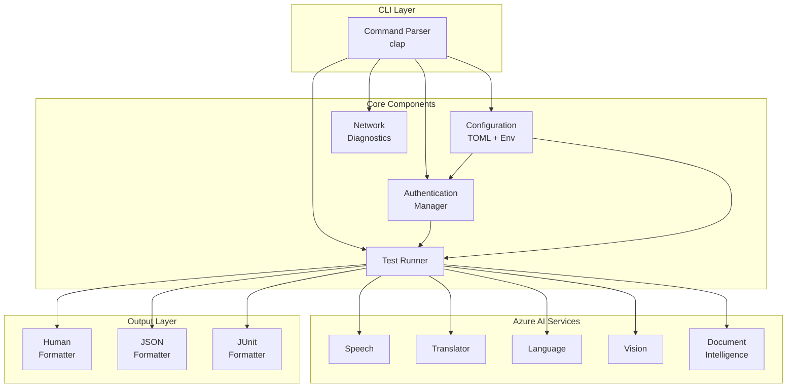
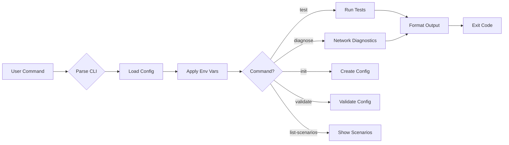
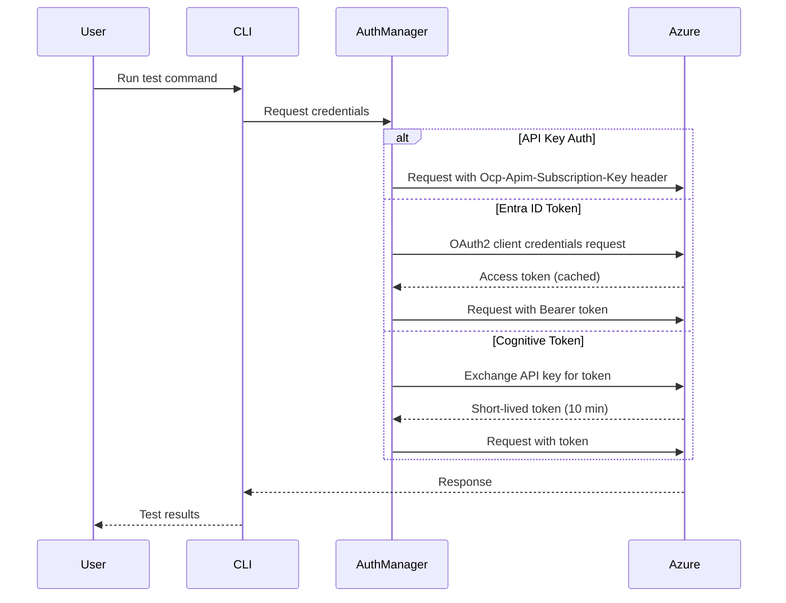
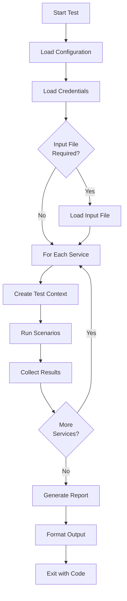
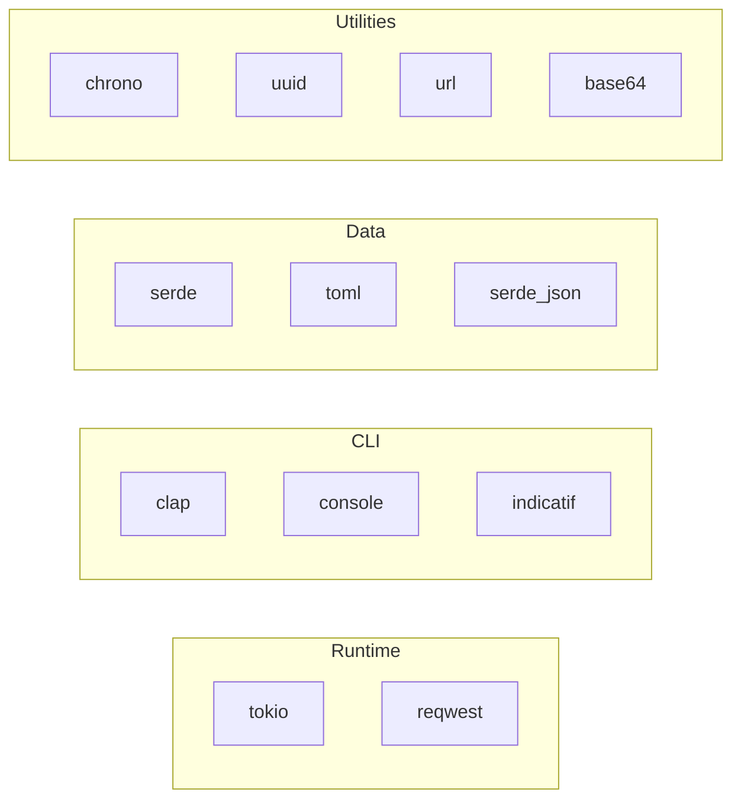

# Azure AI Tools Connect

A Rust-based CLI tool for verifying connectivity from clients to Azure AI Services in complex network environments. Ideal for troubleshooting connectivity issues, testing API authentication, and validating service accessibility before deploying applications.

## Features

- **Multi-Service Testing** - Test Speech, Translator, Language, Vision, and Document Intelligence services
- **Multiple Authentication Methods** - API keys, device code flow, managed identity, manual tokens, service principals, and cognitive token exchange
- **User-Friendly Authentication** - No Azure CLI required - authenticate directly via device code flow
- **Azure Environment Support** - Automatic authentication in Azure VMs, App Service, and Container Apps via managed identity
- **Network Diagnostics** - DNS resolution, TLS handshake validation, and latency measurement
- **Flexible Configuration** - TOML files with environment variable overrides
- **Multiple Output Formats** - Human-readable, JSON, and JUnit XML for CI/CD integration
- **Cloud Support** - Global Azure and Azure China (Mooncake)

## Architecture Overview



## Command Flow



## Authentication Flow



## Test Execution Flow



## Supported Services

| Service | Description | Example Scenarios |
|---------|-------------|-------------------|
| **Speech** | Speech-to-text, text-to-speech | `voices_list`, `token_exchange`, `stt_short`, `tts` |
| **Translator** | Multi-language translation | `languages`, `detect`, `translate` |
| **Language** | Text analytics and NLU | `sentiment`, `language_detection`, `entities`, `key_phrases` |
| **Vision** | Image analysis and OCR | `analyze_image`, `read_text`, `detect_objects` |
| **Document Intelligence** | Document processing | `layout`, `read` |

## Installation

### Prerequisites

- Rust 1.70+ (Edition 2021)
- Cargo package manager

### Build from Source

```bash
# Clone the repository
git clone https://github.com/enu235/azure-aitoolsconnect.git
cd azure-aitoolsconnect

# Build release binary
cargo build --release

# Binary located at ./target/release/azure-aitoolsconnect
```

### Install via Cargo

```bash
cargo install --path .
```

## Quick Start

```bash
# Initialize a configuration file
azure-aitoolsconnect init --output config.toml

# Test all services with an API key
azure-aitoolsconnect test \
  --services all \
  --api-key YOUR_API_KEY \
  --region eastus

# Run network diagnostics
azure-aitoolsconnect diagnose \
  --dns --tls --latency \
  --region eastus
```

## Configuration

Configuration can be provided via TOML file, environment variables, or CLI arguments.

### Configuration File Structure

```toml
[global]
cloud = "global"           # "global" or "china"
timeout_seconds = 30
output_format = "human"    # "human", "json", or "junit"

[auth]
default_method = "key"     # "key", "token", or "both"

[auth.entra]
tenant_id = "your-tenant-id"
client_id = "your-client-id"
client_secret = "your-client-secret"

[services.speech]
enabled = true
region = "eastus"
api_key = "your-speech-api-key"
test_scenarios = ["voices_list", "token_exchange"]

[services.translator]
enabled = true
api_key = "your-translator-api-key"

[custom_inputs]
audio_file = "/path/to/audio.wav"
image_file = "/path/to/image.png"
```

### Environment Variables

| Variable | Description |
|----------|-------------|
| `AZURE_AI_API_KEY` | Global API key for all services |
| `AZURE_REGION` | Default Azure region |
| `AZURE_CLOUD` | Cloud environment (global/china) |
| `AZURE_SPEECH_API_KEY` | Speech service API key |
| `AZURE_TRANSLATOR_API_KEY` | Translator service API key |
| `AZURE_TENANT_ID` | Service principal tenant ID |
| `AZURE_CLIENT_ID` | Service principal client ID |
| `AZURE_CLIENT_SECRET` | Service principal client secret |
| `AZURE_USER_TENANT_ID` | Tenant ID for device code flow |
| `AZURE_BEARER_TOKEN` | Manual bearer token |
| `AZURE_MI_CLIENT_ID` | Client ID for user-assigned managed identity |

## Authentication Methods

Azure AI Tools Connect supports six authentication methods to accommodate different scenarios:

1. **API Key** - Simplest method for quick testing
2. **Device Code Flow** - User authentication without Azure CLI (NEW)
3. **Managed Identity** - Zero-config authentication in Azure environments (NEW)
4. **Manual Token** - Advanced troubleshooting with custom tokens (NEW)
5. **Service Principal** - Enterprise automation with Entra ID
6. **Both** - Fallback between API key and service principal

### Quick Examples

```bash
# API Key (simplest)
azure-aitoolsconnect test --api-key YOUR_KEY --region eastus

# Device Code Flow (no Azure CLI needed)
azure-aitoolsconnect test --auth device-code --tenant YOUR_TENANT_ID --region eastus

# Managed Identity (Azure environments)
azure-aitoolsconnect test --auth managed-identity --region eastus

# Service Principal (automation)
export AZURE_TENANT_ID=... AZURE_CLIENT_ID=... AZURE_CLIENT_SECRET=...
azure-aitoolsconnect test --auth token --region eastus
```

### Which Method Should I Use?

| Scenario | Method | Why |
|----------|--------|-----|
| Local development | Device Code | No Azure CLI, works everywhere |
| Azure VM/App Service | Managed Identity | Secure, no credentials |
| CI/CD Pipelines | Service Principal | Designed for automation |
| Quick testing | API Key | Fastest setup |

📖 **For detailed authentication setup and troubleshooting, see [USAGE.md](USAGE.md#authentication)**

## Exit Codes

| Code | Meaning |
|------|---------|
| `0` | Success - all tests passed |
| `1` | Test failure - one or more tests failed |
| `2` | Authentication failure |
| `3` | Network failure |
| `4` | Configuration error |
| `5` | Invalid input |

## Project Structure

```
azure-aitoolsconnect/
├── Cargo.toml              # Project manifest
├── src/
│   ├── main.rs             # CLI entry point
│   ├── lib.rs              # Library exports
│   ├── cli/mod.rs          # Command definitions
│   ├── config/mod.rs       # Configuration management
│   ├── auth/mod.rs         # Authentication providers
│   ├── error/mod.rs        # Error types & exit codes
│   ├── output/mod.rs       # Output formatting
│   ├── testing/mod.rs      # Test runner
│   ├── network/mod.rs      # Network diagnostics
│   └── services/           # Service implementations
│       ├── mod.rs
│       ├── speech/
│       ├── translator/
│       ├── language/
│       ├── vision/
│       └── document_intelligence/
└── config/
    └── example.toml        # Configuration template
```

## Dependencies



## License

MIT License - see [LICENSE](LICENSE) for details.

## Contributing

Contributions are welcome! Please read our contributing guidelines before submitting pull requests.

## Support

For issues and feature requests, please use the [GitHub Issues](https://github.com/enu235/azure-aitoolsconnect/issues) page.
